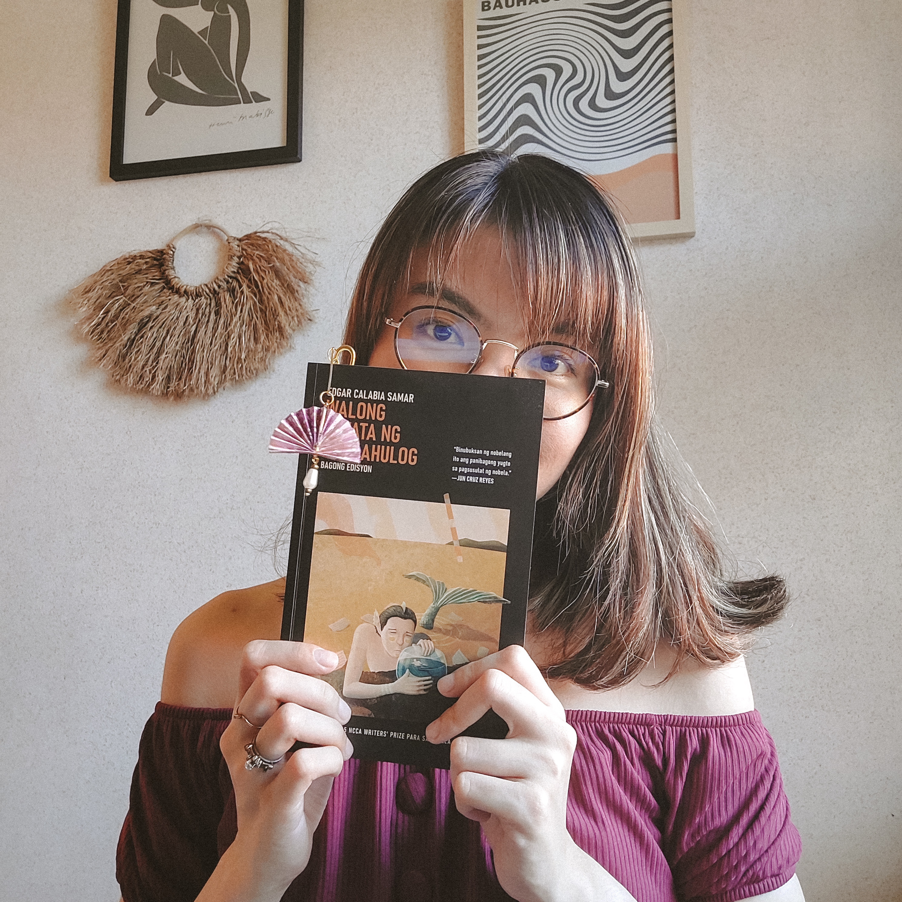

# About

¡Hola! Welcome to my little corner of the internet. ✨ 

This is where I document my musings on language learning, writing, life, and everything else in between.

## Who I am
I’m Anne—a content professional by day, a dreamer and lifelong learner by night.

I love languages. I speak Tagalog, English, and a little bit of Spanish. I’ve been trying to learn Japanese for most of my life, but I never made much progress. I recently decided to _finally_ take it seriously, and I’m hoping that I’ll last more than a couple of months this time around.

In the past, I’ve also dabbled in French, Italian, German, Swedish, Russian, Polish, Korean, and Chinese.

Some of my other hobbies and interests include:
* reading
* animé and manga
* videogames
* fitness (walking, running, and yoga)
* coffee, tea, and matcha
* all things cozy and aesthetic
* ...and so much more!

## Why I started this blog
Language learning is, and always will be, one of my favorite rabbit holes. I don’t talk about it enough! I needed a safe space to dump my notes, scattered thoughts, and reflections—so here I am.

I opted for a blog because writing is my most comfortable form of self-expression. I’ve also neglected it long enough, and I figured it was high time I got back to it. In other words, this is my latest attempt at establishing a writing practice.

I’ve already abandoned an embarrassing number of writing projects, and I can’t promise that this won’t be on the back burner after a few months, but I’m not giving up just yet. I love rambling and having side projects far too much to stop.

And who knows? Maybe this is _the_ project that will finally get me writing consistently.

## What to expect
* **Walls of text on language learning and writing.** You’ve been warned.
* **Non-traditional—perhaps “inefficient”—learning methods.** Language learning is very personal. What works for me may not work for you, so take everything with a grain of salt. You probably won’t agree with some of my methods, and that’s okay! In fact, it’s what makes language learning so fun and exciting. We all have different priorities, preferences, and learning styles, and there’s simply no one right way of doing things.
* **Meta posts about writing.** This blog is a writing practice first and foremost, so you can expect some entries about the writing process itself. The fact that I get to nerd out on languages is just a lovely bonus. Besides, writing _is_ an important facet of language learning, isn’t it?
* **Occasional posts on miscellaneous topics.** I might ramble about my other hobbies, latest hyperfixations, or life in general. Many of my interests, particularly [reading](/tags/Reading/) and [gaming](/tags/Gaming/), also shaped my language learning and writing in one way or another, so I think they deserve a spot on this site.

## What _not_ to expect
* **Language learning advice.** I don’t feel qualified enough to tell you how to learn or acquire a language, and there’s already plenty of information online. I just want to share my experience learning Spanish and Japanese, along with my reflections on languages in general. If it helps you with your own learning journey, then great! But that’s not my goal.
* **Beautiful, eloquent writing.** My entries will likely be messy—an attempt for me to dissect my brain and translate my mangled thoughts into paper. While I’ll do my best to clean up my writing, ensuring there are no obvious grammatical errors and all that, I know it’ll still be rough around the edges.
* **Complete, fully comprehensible entries.** I’m writing mainly for myself. So if something doesn’t make sense, like there’s missing context or whatnot, it’s because I’m literally _not_ writing with the reader in mind.

## How to browse this site
I’ve added tags to each post for easy navigation. Go to [Tags](/tags/) for the complete list.

To get started, navigate to any of the site’s main categories:
* [Spanish](/tags/Spanish/)
* [Japanese](/tags/Japanese/)
* [Language learning](/tags/Language%20learning/)
* [Writing](/tags/Writing/)

Here are additional tags for my ongoing series:
* [Spanish media diaries](/tags/Spanish%20media%20diaries/)
* [Spanish weekly round-up](/tags/Spanish%20weekly%20round-up/)
* [Japanese progress updates](/tags/Japanese%20progress%20updates/)
* [Language wins](/tags/Language%20wins/)
* [Life lately](/tags/Life%20lately/)

I’ve also added relevant writings from other sites and platforms (including [Substack](/tags/Substack/) and [Medium](/tags/Medium/)). You’ll find the articles on [Archive](/tags/Archive/), and they’ll also appear in the main categories they belong to. This is still a work-in-progress.

## Let’s chat
Have a question or just want to say hi? Feel free to reach out to me on [Reddit](https://www.reddit.com/user/annemuses/) or by [email](anne.mensajes@gmail.com). 

You can also DM me on Discord: `anne_idiomas`.

---

_P.S. I’ve taken and edited all the photos on this site. Please do **not** use any of them without explicit permission._