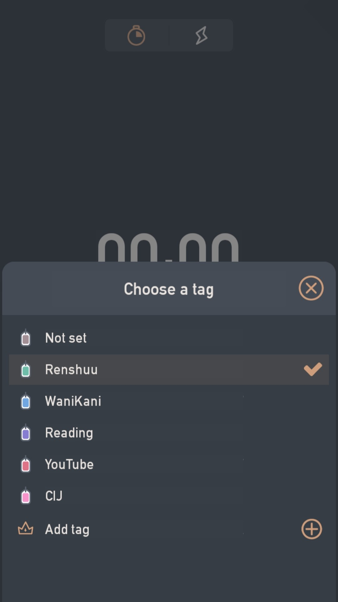
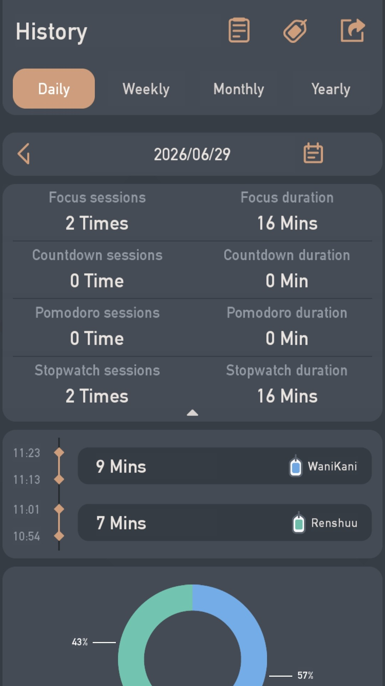
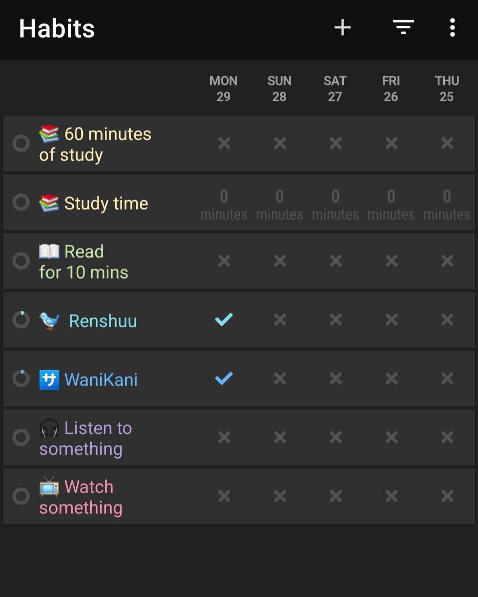

It’s a Monday, and I’m not dreading it for a change. Instead, it feels like a fresh start, and I’m excited to see how the upcoming week will go!

More importantly, today is officially the start of my 75 fluent challenge for Japanese.

I’ve heard of the 75 hard before, but I never paid attention to it. After all, it sounded a bit too intense and daunting for me to ever attempt it. But a week ago, I came across an interesting video from Jo, one of my go-to language learning YouTubers:
 

<iframe width="560" height="315" src="https://www.youtube.com/embed/Xj1gaDXNvm8?si=wwbAS_vWPWDUL7AR" title="YouTube video player" frameborder="0" allow="accelerometer; autoplay; clipboard-write; encrypted-media; gyroscope; picture-in-picture; web-share" referrerpolicy="strict-origin-when-cross-origin" allowfullscreen></iframe>

 

75 fluent is essentially the 75 hard challenge, but adapted for language learning. It’s created by another content creator named Logan. Here’s the video where she delved into the specifics:
 

<iframe width="560" height="315" src="https://www.youtube.com/embed/x2vK4fWDurc?si=2QiT1pejHrxNpYHm" title="YouTube video player" frameborder="0" allow="accelerometer; autoplay; clipboard-write; encrypted-media; gyroscope; picture-in-picture; web-share" referrerpolicy="strict-origin-when-cross-origin" allowfullscreen></iframe>

 

Do check out these videos for more context on the challenge.

## Rules of 75 fluent
The challenge is pretty straightforward and has 6 rules: 
1. 60-minute language study
2. Read 5 pages
3. Watch something
4. Journal
5. 5 minutes of speaking
6. Track your study

As the challenge name suggests, you need to do every single one of those activities for 75 days.

## Revised rules of 75 fluent
The original rules of the challenge don’t work for me because I’m not yet producing anything in Japanese. I’m still in the early stages of my study—consuming content, building my vocabulary, and familiarizing myself with grammar points.

So, I decided to tweak the rules to make it work for my needs:

1. 60-minute language study
2. Read for 10 minutes
3. Watch something
4. Listen to something for 15 mins
5. Renshuu
6. WaniKani
7. Track your study

### Changes I made
- I’m not reading books yet, so I updated “Read 5 pages” to “Read for 10 minutes”. It makes perfect sense for my situation since I use various apps to read basic stuff in Japanese.
- I added “Listen to something for 15 mins” just because I’m trying to listen to as much Japanese as possible, be it actively or passively. The indicated time is the bare minimum; I’ll likely exceed the 15 minutes most days.
- I added “Renshuu” and “WaniKani” because they’re currently my main resources for active study. But since I took a break from Japanese for several weeks, my backlog is still… massive. So, right now, my priority is to just catch up on my reviews. I don’t want to be too strict with myself on how many words or how much time I should study per day.

## How I’m tracking my studies
I’m using an app called [Striving](https://play.google.com/store/apps/details?id=com.shikudo.focusapp.google&hl=en) to track my study time across different areas of the challenge.[^1] Here’s my setup:

:::gallery

:::

Meanwhile, I’m using [Loop Habit Tracker](https://loophabits.org/) to track the activities I managed to do in a day.

Both apps have premium options, but the free versions are good enough for my use case.

## What to expect
I plan to share progress updates every 25 days for accountability:[^2]
- __25th day update:__ July 24, 2026 (Friday) 
- __50th day update:__ August 18, 2026 (Tuesday)
- __75th day update:__ September 11, 2026 (Friday)

I’ll share screenshots of the data from my apps and reflect on my experience so far. I _might_ also post a write-up at the end of the challenge if I feel like it, but we’ll see how it goes first.

I’m not sure what to expect. It’s my first time doing such a major challenge, and it’s extra intimidating because I took a month or so off from Japanese. But I think this is the perfect opportunity to get back into it.

I know I won’t always hit 60 minutes, especially when I’m out hiking or on my little adventures, but I’ll do my best.

I’m giving myself a lot of flexibility to fail, start over, or update the challenge rules as I see fit.[^3]

Anyway, that’s it for now! I’ll see you in 25 days.

[^1]: [Renshuu](https://app.renshuu.org/) and [WaniKani](https://www.wanikani.com/) are for grammar and vocabulary. Reading is self-explanatory. YouTube and [CIJ](https://cijapanese.com/) (Comprehensible Japanese) are for watching and listening.
[^2]: I’ll update the list with the links as I publish my progress update posts.
[^3]: I’m also allowing myself to quit if the challenge isn’t working for me.