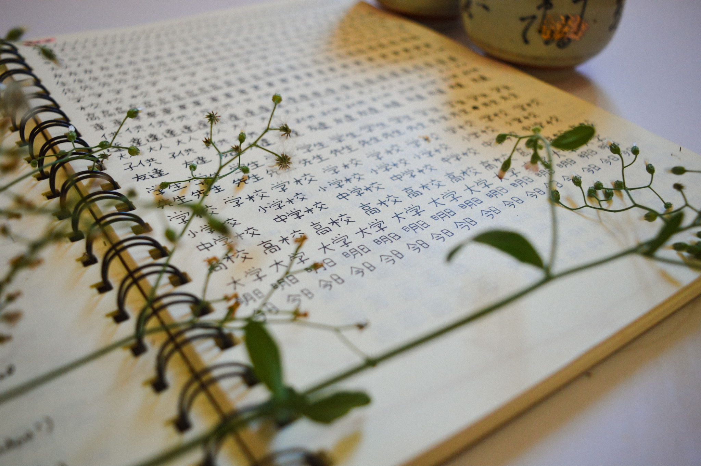
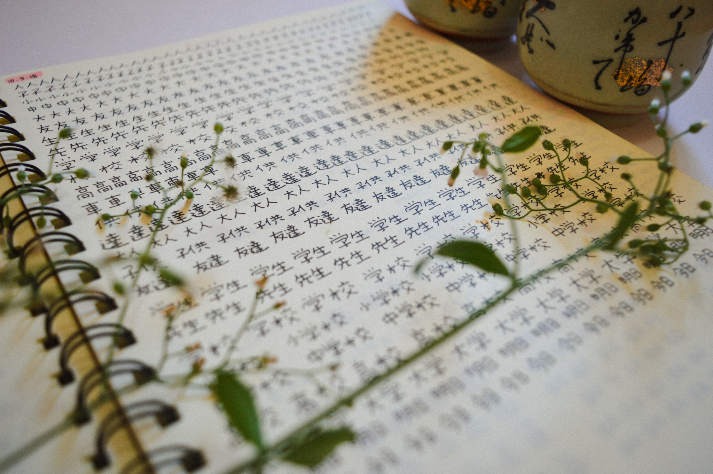
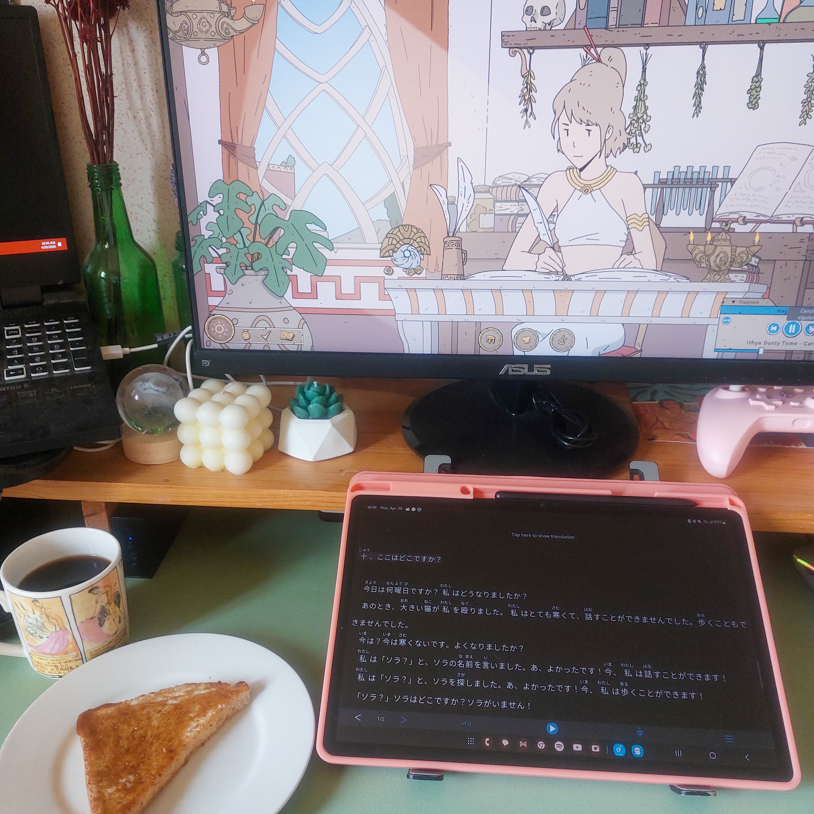

I’ve always had a love-hate relationship with the Japanese language.

Like many Filipinos born in the 90s, I grew up watching anime, so naturally, I became drawn to Japanese culture from an early age. I can still remember rushing home from class so I could watch the latest episodes of Sailor Moon, Card Captor Sakura, Fushigi Yuugi, Hunter x Hunter, and Ghost Fighter, among many others. I _devoured_ whatever was airing on local television, regardless of the genre.

When I was ten, I became close friends with a Japanese boy in my class, who got wind of my anime obsession and decided to lend me a Japanese textbook.

It was a symbolic moment for several reasons.

For one, it was my first ever official contact with the language. After all, I’d been watching anime dubbed in Tagalog, and all the Japanese I heard was limited to the opening and ending songs.

But more importantly, it was my first attempt to learn a language on my own. I’d like to believe that it was the spark that ignited my fascination with languages.

I’d always been a diligent student, and let me tell you: I was _hooked_. I blazed through the chapters, jotting down interesting vocabulary in a two-column notebook. Japanese on the left—written in rōmaji because I didn’t bother learning ひらがな and カタカナ just yet—and the English definition on the right.

It was a promising start, but two decades later, here I am, still trying to learn Japanese. Still far from fluent. I haven’t even mastered N5 yet.

So, what happened?

## The never-ending loop
I always blamed my complicated—bordering on toxic—relationship with the language.

Japanese has always fascinated me, but my feelings toward it constantly oscillated between love and hate. I’d be obsessed with it for a couple of months, cramming as much information in my brain as if I were preparing for a high-stakes exam on short notice. Then, I’d be frustrated at how complex the language is and decide to abandon it for the next few months to a year.

Eventually, I also ended up blaming my undiagnosed ADHD (the bane of my existence, but a convenient scapegoat when things go awry). When a new, shiny thing came my way, I’d immediately put Japanese on the back burner. It just didn’t seem worth the time and effort anymore.

Ultimately, though, I think it boils down to perfectionism (which, funnily enough, is probably _because_ I’m on the spectrum, but we’ll never know for sure until I get diagnosed). But I digress.

I’ve self-studied Spanish to a fairly decent level, and by now, I know that there are no magic tricks or shortcuts when it comes to language learning. It’s really just about consistency _and_ time. Once you establish a routine that works for you and you stick with it long-term, you’re bound to reach some kind of fluency in your target language. 

Unfortunately, that never occurred to me in Japanese.

---

As I mentioned, I always ended up abandoning it for one reason or another. A new hobby or obsession would enter the picture. I’d be stuck in the research or planning stage, then be trapped in decision paralysis. I’d overdo it with resources, do too much all at once, then inevitably succumb to burnout. Or, maybe, I’d simply lose all interest or motivation.

At one point—I think it was sometime during the pandemic—I declared that I was done learning Japanese _for good_. I wrote a detailed journal entry on my decision, and it felt liberating and cathartic at the same time. I was finally free from the clutches of this beautiful yet demanding language, and it was as though a heavy boulder had been lifted off my shoulders.

But of course, it only lasted less than a year before the toxic loop started all over again. 

Something would always tempt me to pick Japanese back up, regardless of how many times I’ve failed. It was inevitable. After all, I was almost always consuming Japanese media.

I was bound to fall back in love with it, no matter what.

## Timeline of my Japanese studies
Whenever someone asks me how long I’ve been learning Japanese, I can never provide a proper answer.

In the end, I always default to something like, “I’ve been studying it on-and-off for most of my life.” It’s true, but it doesn’t quite capture the full picture. Most of that time was spent on unproductive activities, not to mention that I acquired most of my knowledge only within the last couple of years.

Anyway, it’s been a long, winding journey, and I think it’s time I finally sit down and reflect on what I’ve done and learned so far.

### 2005
A friend lent me a textbook on learning Japanese. You already know the story.

### 2006 to 2013
I casually tried to learn Japanese with online resources and a book written for Filipinos. I don’t remember the title anymore; it’s a slim book I randomly found in a local bookstore, and the Japanese was written solely in rōmaji. Interestingly enough, it provided comparisons between Japanese and Tagalog, particularly grammar and syllabary.

But overall, my Japanese studies during this period were intermittent, and I didn’t get very far.

I learned greetings, basic phrases, and everyday sentences, but it was mostly rote memorization. My understanding of grammar was rudimentary at best—stuff like basic sentence structure, word order, です, and particles. I also finally learned how to read and write ひらがな and カタカナ. Lastly, my passive vocabulary increased as I watched more anime and listened to more Japanese songs.

### 2013
I enrolled in a 30-hour in-person basic Japanese class over the summer. We breezed through Genki I, but I was already familiar with most of the grammatical concepts and structures discussed in the book. I finally learned some kanji and tried speaking in Japanese for the first time.

Once the class was over, I got obsessed with writing in Japanese. I kept a simple handwritten journal, written in kana and the few kanji that I knew. I also jotted down the lyrics of anime songs. I most likely skimmed through my notes and remember checking out [Tae Kim’s Grammar Guide](https://guidetojapanese.org/learn/), a resource our sensei recommended.

### 2014 to 2018
Life revolved around university and my first job. I don’t remember doing any active study during this period. I might have experimented with a few apps, but Japanese simply wasn’t a priority during this time. I continued watching anime when I could.

### 2018 to 2020
I resumed my Japanese studies. I started by revisiting Genki I, reviewing my notes, and doing some of the exercises. Additionally, I tried to learn more kanji by writing them in my notebook in neat, careful strokes. It was, needless to say, inefficient. I focused more on writing kanji instead of learning their meanings or readings. 

I _mean_, look at my notes...

:::gallery

:::

### 2020
The pandemic blues happened. I got fed up with learning Japanese and told myself that I was officially done with the language. I would _never_ touch it ever again. 

### 2021 to early 2025
To no one’s surprise, I got inspired to pick up Japanese again and tried various methods and resources. Like most language learners, I got sucked into rabbit holes of _how_ to learn Japanese. The “loop” happened several times, and I implemented a new approach each iteration.

Here’s what I tried (in no particular order):
* Busuu
* Bunpro
* Renshuu
* WaniKani
* Lingodeer
* Yomu Yomu
* Satori Reader
* Anki (Japanese Core 2k and Refold’s ES-JP 1k decks, among many others)
* Genki books (again), paired with Seth Clydesdale’s [Genki exercises](https://sethclydesdale.github.io/genki-study-resources/) and Tokini Andy’s [YouTube videos](https://www.youtube.com/playlist?list=PLA_RcUI8km1NKAoxPzDoIoflnd6bNC7Qm)
* [Organic Japanese with Dolly Cure](https://www.youtube.com/channel/UCkdmU8hGK4Fg3LghTVtKltQ) (I only read the transcripts—someone collated and annotated them in a comprehensive Google Docs file)

Take note that I only included the resources that I managed to use for longer than a couple of weeks. I’m sure I tried more, but they just didn’t make the cut. Off the top of my head, I remember trying out Bunpo, Clozemaster, Duolingo, Memrise, and MochiKanji.

I discovered comprehensible input during this time and started consuming beginner-level content on Spotify and YouTube. I’ll write about my favorite podcasts and channels on a separate post.

### September 2025
I don’t know what came over me, but I decided to experiment and try a new approach once again. I used [Dreaming Spanish](https://www.dreaming.com/spanish) a lot when I first started learning Spanish, and I thought, _Why not do the same with Japanese?_

[Comprehensible Japanese](https://cijapanese.com/) (CIJ) is, without a doubt, one of the best resources for this.

When I first learned about CIJ a few years ago, it was only available on YouTube, with an option to support Yuki, the creator, through Patreon. 
But when I checked it again at the time, they had already launched a website and subscription plans. It was similar to what Dreaming Spanish had (which, admittedly, I had never used; it didn’t exist yet when I was learning Spanish).

I’ve always liked the work that Yuki does, and I wanted to support her and the rest of the CIJ team. So after trying out their website for a couple of weeks, I went ahead and grabbed an annual subscription.

The CIJ website is clean and intuitive, and there are so many nifty tools and features that make it ridiculously easy to immerse in Japanese, even if you’re starting from zero. For one, it automatically tracks your listening hours, which serves as a great way to gauge your level and progress. I also like how you can easily filter videos by difficulty, topics, and more, allowing you to customize the viewing or listening experience.

The idea is pretty straightforward. Start with Complete Beginner content, ensuring you watch the videos _without_ subtitles or looking anything up. Just try to follow the videos’ message using the visual context provided, such as drawings, photos, or gestures. Your brain does all the work for you. Over time, you’ll find that your comprehension increases and you can move on to the next level. 

> [!TIP]
> Check out the [CIJ Guide](https://cijapanese.com/guide/intro) for more information.

On the side, I continued listening to beginner podcasts on Spotify. But I stopped all forms of active study.

In retrospect, I think I just wanted to tell myself that I was learning Japanese _without_ dedicating a lot of time and effort into it. That is, I wanted to study the language casually, and watching videos seemed like the bare minimum.

### March 2026
I finally hit 50 hours on the CIJ website. Yes, it took me six freaking months to do it. 

My goal was to watch at least 30 minutes of CIJ every day, but it was harder than I expected. I only immersed about one to two hours of CIJ content weekly for most weeks (if any at all). The complete beginner videos were a real slog, and as soon as I hit play, I found myself getting distracted and wanting to do something else. I suddenly wanted to tidy up my room, or do an admin task I’d been putting off for weeks. I had to force myself to sit down and actually watch.

To be honest, I also quickly lost motivation. I was excited in September, still stuck in the honeymoon phase, but my enthusiasm quickly dwindled, and by December, I wanted to quit again. But I didn’t; I somehow forced myself to show up when I could.

After hitting my 50-hour milestone, things shifted. All of a sudden, I got inspired to pick up Japanese _for real_. The purist CIJ method didn’t work for me (not that I expected it to; again, I opted for that resource because it simplified the learning process, and it allowed me to do the bare minimum), and I was ready to move on and change things up a little.

### April 2026
After weeks of toying with the idea of taking Japanese seriously, I finally started experimenting and establishing a new study routine—but that’s a story for another post.

## An important turning point
Well, that was quite the journey. So when I say that I’ve tried so many different resources, I _really_ do mean it.

It’s worth pointing out that a huge shift occurred to me sometime during 2023 to 2024—not just for Japanese, but for language learning as a whole.

That is, I matured a lot as a language learner. After a few years of trying to “acquire” Spanish, I finally figured out my learning style. As a result, I learned to block out the noise—I stopped relying on others too much and learned to trust my own gut and decisions. I know myself, and I know what works for _me_, even if others say my method is inefficient or doomed to fail.

Who cares?

There’s too much information online, and people claiming that this or that method is the best. It can get overwhelming pretty fast. At the end of the day, I believe it all boils down to what you can do consistently. What’s the point of an “effective” method when it makes you dread—or worse, detest—learning the language to begin with?

For example, I finally accepted that Anki and the Genki books (or any structured textbooks, for that matter) no longer have a place in my routine. I’ve tried them far too many times already, and they always ended up demotivating me and derailing my learning journey. (As I’m typing this, I can just about imagine the Redditors at [r/LearnJapanese](https://www.reddit.com/r/LearnJapanese/) coming for me.)

As much as I love stationery and writing by hand, taking notes doesn’t work for me. I also learned that pure immersion isn’t for me either. And while we’re on the topic, let me just say that I’m _sick_ of people who just say, “Just immerse bro,” as if there’s just one way to learn a language, and I hate it when some of them even go so far as to mock or dismiss those with a different approach. I know the value of immersion, but there’s nothing sacrilegious about doing something else on top of it, such as, say, explicit grammar study, in-person classes, or whatever floats your boat. My point is, things aren’t always black and white when it comes to language learning, and it grates me when people act or believe otherwise.

I have tons of other realizations. I promise to explore them in more detail in the future.

Even though I didn’t make much progress in Japanese over the past few years, I’m still grateful because I learned so many other valuable things—tools, resources, approaches, _and_ perspectives that will help me learn Japanese on my own terms when I’m ready.

And I think that time has finally come.

Anyway, that’s about it. I just wanted to reflect on my previous learning experience before I rant about Japanese any further.

Now that the admin stuff is finally out of the way, we can move on to the fun part. さあ、行こう！