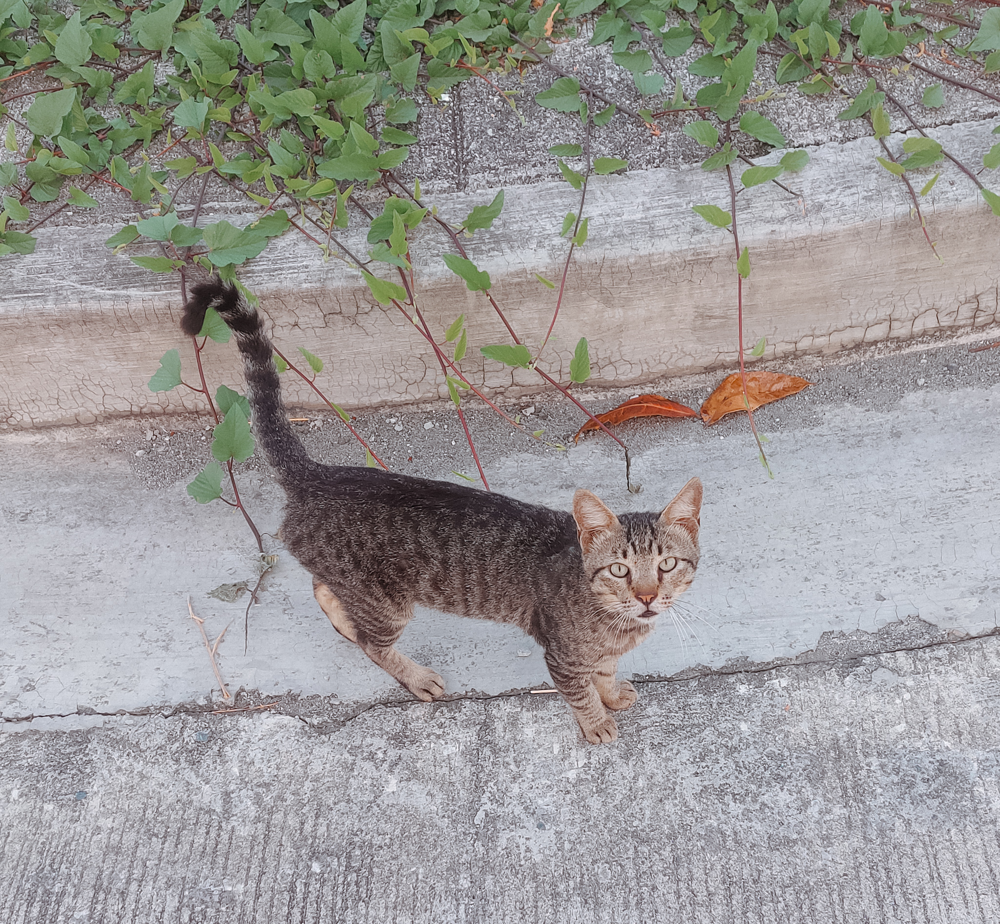
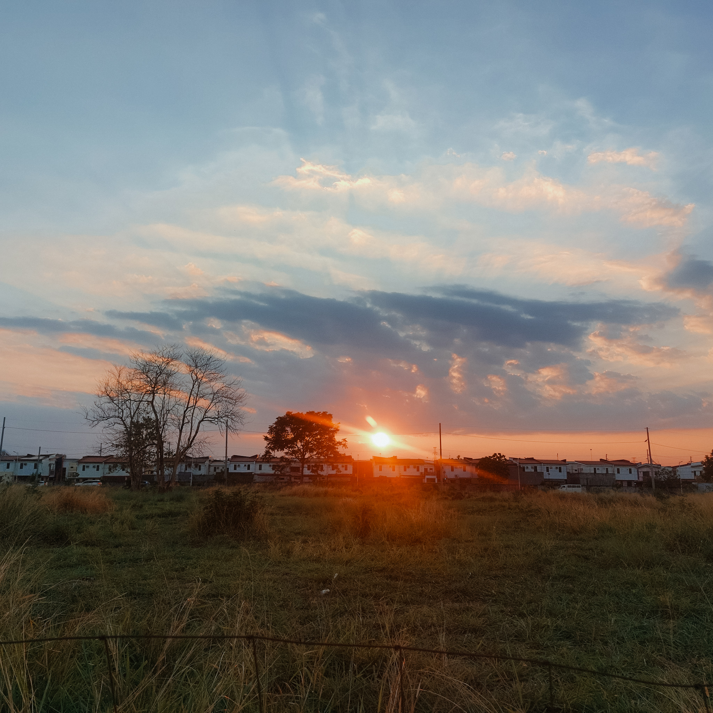
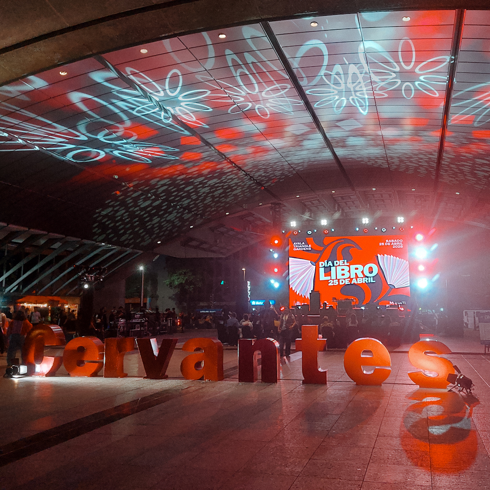

“Experience” is one of my mantras this year.

That is, I want to fill my cup with different activities and memories, _not_ things. I already have too much clutter, too many unused items collecting dust, and I wanted to prioritize spending my hard-earned money more meaningfully instead.

As a homebody, this also means literally going out of my comfort zone and having little adventures outside. It wasn’t such a dramatic shift; after all, I’ve always loved going on solo dates, but I knew that I didn’t do it as often as I should.

So, as soon as 2026 arrived, I vowed to myself that I _am_ going to be a bit more adventurous this time around. We’re almost halfway into the year, and I’m proud to say that things have been going swimmingly.  

The past few weeks have been a delight, and I wanted to take a moment to pause and reflect.

## What I’ve been up to
* Going on long walks right after sunrise or before sunset, with no music or podcast on, just listening to the birds chirping and letting ideas and inspiration hit me in waves
* Trying—and often failing—to befriend the cats and dogs in our neighborhood
* Slowly getting back to running
* Reading way too many crime/mystery/thriller books; they will _always_ be my guilty pleasure
* Doing admin tasks I’ve been procrastinating for months, and riding off the high for days (there’s still more to come, but I have to celebrate my wins)
* Lots of solo dates and food trips
* Finally starting another writing project and getting obsessed with the creative process all over again

## Simple joys
* Watching the bees in the morning, buzzing and dancing in a frenzy as they moved from one plant to another (but I have to admit it makes me anxious when they get a tad too close to me)
* Birds _everywhere_; I feel privileged to live in a neighborhood with plenty of areas where birds can rest
* Witnessing the sky change colors, and the sun dip into the horizon
* Going to the secondhand bookstore and finding the exact books you were looking for, as well as books you didn’t know you needed (and for a very low price!)
* My pile of physical books, because sometimes you’re just in the mood to smell the pages and ink and to feel the paper between your fingertips
* Taking my little notebook with me everywhere I go, so I can jot down ideas before they fade into oblivion
* Making my usual iced coffee (or matcha) early in the morning, carefully measuring the ingredients and ensuring nothing is a gram too heavy
* The smell of freshly ground beans
* Enjoying my homemade smoothie in the garden, just _being_ and feeling the breeze and the afternoon sun on my skin
* Craving and discovering delicious iced teas with the perfect balance of sweetness, strength, and flavor (some of my favorite blends were lemongrass/ginger, mixed berries, and guyabano/calamansi); I also got to support small businesses as a bonus!
* Going to a Sunday market first thing on a Sunday morning
* Meal-prepping for office days—it’s always a game to see how colorful, nutritious, and balanced I can make my lunches
* Stumbling upon an album that just speaks to me on so many levels, and listening to my favorite songs on repeat
* Turning on my candle warmer at night, with the aroma of cotton candy or pine wafting in my room before I doze off
* Trying out new restaurants with family, and just a lot of quality time with loved ones in general, including a spur-of-the-moment road trip to Tagaytay—good food, good company 

## Little adventures

### Stardew Valley Symphony of Seasons concert

After months of waiting, I finally went to the Stardew Valley Symphony of Seasons concert! It was such a beautiful experience. When the first music started, goosebumps dotted my arms, and I wanted to cry so badly (but I somehow managed to stop myself because I didn’t want to ruin my eye makeup).

While I don’t actively play Stardew Valley anymore, this game still holds a special place in my heart. I never thought I’d ever get to hear the soundtrack performed live!

### Día del libro 2026

I’ve always wanted to go, but unfortunately, it fell on the same date as the SDV concert. I got to Ayala Triangle quite late and missed most of the events. I still managed to snag a few books in Spanish, though! It was strange to be surrounded by so many foreigners at once and to actually understand everything they were saying.

By the time I left (around half-past nine), the concert was already in full swing.

### Cafés

I always _love_ going to coffee shops by myself, just people watching, planning, or catching up on some reading. I haven’t spent much time in cafés lately, and when I did, I preferred going to my favorites rather than exploring new places.

## Other musings
* I’ve been thinking a lot about cycling lately. I haven’t ridden a bicycle in more than a decade, and I actually told myself I would never ride one again after I nearly got into so many accidents, but here I am. My dad and brothers are avid cyclists, so they’re all enabling me to get back into it.
* There’s a part of me that feels like this kind of post belongs to another site altogether. I feel almost guilty in indulging myself and ranting about something not explicitly related to language learning and writing. But who cares? I did mention it in my [About](/about/), and even if I didn’t, it doesn’t matter. This is _my_ blog, after all, and I can write whatever I damn please. The last thing I want is to start too many projects all at once and eventually burn out.
* I also thought about labeling this as “monthly archive,” but I decided against it because I don’t want the pressure or expectation to do this every month.

That’s it for now. Catch up again soon! ✨